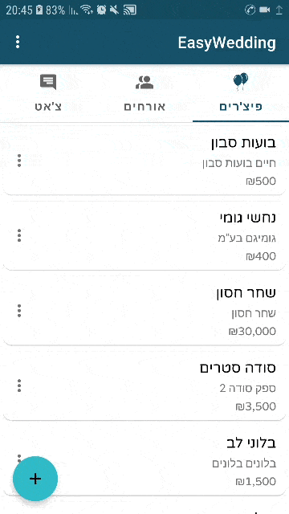

# EasyWedding
This app is my degree final  project.

Simulation are in Hebrew. However, there's also support for English.

EasyWedding is an Android app that helps couples who are getting married to organize their wedding.

***Build is in progress.***
  ### Todos
   ##### General
   - Integrate MVVP.
   - Query contacts asynchronously (using java.util.concurrent)
   ##### Chat
   - Push Notification.
   - Message confirmation.
   - Indication of when a user joins the chat or leaves the chat.
   - Sound feedback to actions.
   - Quotation.
   - Send/receive image and pdf. 

### Demos

#### Guests                      
  

#### Features

##### Chat

#### Shared data - ask for access and grant access

##### Arrival confirmation (Web) and update in Android

#### Export guests

### App Features
  
    - Multi-User Chat, for wedding content only.
    - Shared data - ask for data access and grant access to data.
    - Arrival confirmation mechanism (Web + Android).
    - Visual indication for guests arrival.
    - Visual indication for payments to suppliers.
    - CRUD operations on guests and features.
    - Delete features by supplier
    - Export guests and features with relevant data.
    - Display the number of arriving guests and their joiners in the action bar. 
    - Varied sort options for features and guests. For example, sort guests such that guests that are (not) arriving displayed first.  
    - Strong data validation on features and guests forms.
    - Support in Url, Phone Number and Email parsing (in chat).
    - Firebase AuthUI sign-in flow.   
    - Supported languages are English and Hebrew.

### Database
 - Firebase Realtime Database 
     

